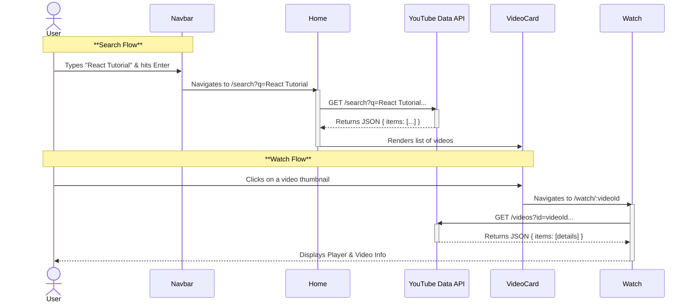

# Media Streamer

Media Streamer is a modern React-based video streaming application that mimics the core functionality of platforms like YouTube. It leverages the YouTube Data API v3 to fetch and display real-time video content, allowing users to browse trending videos, search for specific content, filter by categories, and watch videos directly within the app.

## ⚡ Features

- **Dynamic Video Feed**: Homepage featuring trending videos fetched live from YouTube.
- **Category Filtering**: Seamlessly switch between video categories (Music, Gaming, News, Sports, etc.).
- **Smart Search**: Real-time search functionality to find any video on YouTube.
- **Immersive Video Player**: Integrated playback experience with video details.
- **Responsive Design**: fully responsive layout optimized for all screen sizes (Desktop, Tablet, Mobile).
- **Dark Mode**: Built-in theme switcher with preference persistence.
- **Collapsible Sidebar**: smooth navigation drawer for easy access to app sections.

## � Tech Stack

- **Frontend**: [React](https://react.dev/) (v19)
- **Build Tool**: [Vite](https://vitejs.dev/)
- **Styling**: [Tailwind CSS](https://tailwindcss.com/) (v4)
- **Routing**: [React Router](https://reactrouter.com/) (v7)
- **Icons**: [React Icons](https://react-icons.github.io/react-icons/)
- **Data Source**: [YouTube Data API v3](https://developers.google.com/youtube/v3)

## 📐 Architecture & Data Flow

The application is built using a component-based architecture where data flows unidirectionally (parent to child). Global UI state (like sidebar visibility and theme) is managed at the layout level, while data fetching is handled within specific page components.

### Component Structure Diagram

```mermaid
graph TD
    Main[main.jsx] --> Browser[BrowserRouter]
    Browser --> App[App.jsx]
    
    subgraph "Layout Context"
        App --> Layout[Layout.jsx]
        Layout --> Navbar[Navbar.jsx]
        Layout --> Sidebar[Sidebar.jsx]
        Layout --> ContentArea[Main Content Area]
    end

    subgraph "Routing System"
        ContentArea --> Routes[Routes Definition]
        Routes --> HomeRoute["/ (Home)"]
        Routes --> WatchRoute["/watch/:id"]
        Routes --> UploadRoute["/upload"]
        Routes --> ProfileRoute["/profile"]
        Routes --> SearchRoute["/search"]
    end
    
    subgraph "Page Components"
        HomeRoute --> Home[Home.jsx]
        WatchRoute --> Watch[Watch.jsx]
        UploadRoute --> Upload[Upload.jsx]
        ProfileRoute --> Profile[Profile.jsx]
        SearchRoute --> Home[Home.jsx (Reused)]
    end

    subgraph "UI Components"
        Home --> VideoCard[VideoCard.jsx]
        Home --> ShimmerCard[ShimmerCard.jsx]
        Watch --> IFrame[YouTube Player]
    end
```

### Data Flow & Interaction Sequence

This sequence diagram illustrates how a user interacts with the application to search for and watch a video.



## � Module Breakdown

### 1. Core Application Logic (`src/`)
- **`main.jsx`**: The application entry point. It initializes the React root and wraps the entire app with `BrowserRouter` to enable client-side routing.
- **`App.jsx`**: Defines the central routing configuration. It utilizes the `Layout` component to ensure a consistent page structure (Navbar + Sidebar) across all routes.

### 2. Layout & Navigation (`src/components/`)
- **`Layout.jsx`**: 
  - Functions as the main shell.
  - Manages the boolean state for the sidebar (`isOpen`).
  - Adjusts the main content's left margin dynamically based on the sidebar's state.
- **`Navbar.jsx`**:
  - **Search**: Captures user input and navigates to the search results view.
  - **Theme Toggle**: Toggles a `dark` class on the `document.documentElement` and persists the preference to `localStorage`.
  - **Menu Toggle**: Calls the `toggleSidebar` function passed down from `Layout`.
- **`Sidebar.jsx`**:
  - Renders navigation links.
  - Highlights the current active route using `useLocation`.
  - Collapses to a mini-variant (icons only) or expands to full width based on the `isOpen` prop.

### 3. Page Logic (`src/pages/`)
- **`Home.jsx`**:
  - **Responsibility**: Displays the main video feed.
  - **State**: Manages `videos` list, `loading` status, and `activeCategory`.
  - **Logic**: 
    - On mount or category change, it requests data from the YouTube API.
    - Shows `ShimmerCard` components during loading to prevent layout shift.
    - Renders `VideoCard` components once data is available.
- **`Watch.jsx`**:
  - **Responsibility**: Displays the video player and details.
  - **Logic**: 
    - Reads the `id` from the URL parameters using `useParams`.
    - Fetches specific details (like view count, title) for that video ID.
    - Renders a responsive `iframe` pointing to `https://www.youtube.com/embed/{id}`.

### 4. UI Components (`src/components/`)
- **`VideoCard.jsx`**: A presentational component that receives a video object. It displays the thumbnail, title, channel name, and relative published time (e.g., "2 days ago").
- **`ShimmerCard.jsx`**: A loading skeleton component that mimics the shape of a video card, providing visual feedback while data is being fetched.

## ⚙️ Setup & Installation

1.  **Clone the repository**
    ```bash
    git clone https://github.com/your-username/mediastreamer.git
    cd mediastreamer
    ```

2.  **Install Dependencies**
    ```bash
    npm install
    ```

3.  **Configure Environment Variables**
    Create a `.env` file in the root directory and add your YouTube Data API key:
    ```env
    VITE_VIDEO_API_KEY=your_actual_api_key_here
    ```
    > **Note**: You can get an API key from the [Google Cloud Console](https://console.cloud.google.com/).

4.  **Start Development Server**
    ```bash
    npm run dev
    ```

The app will be available at `http://localhost:5173`.
